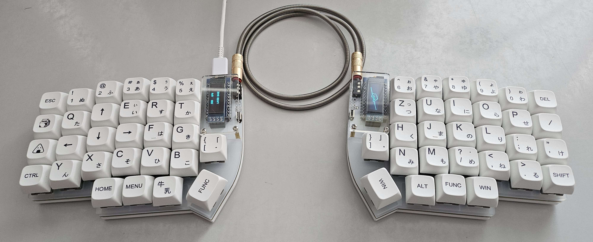
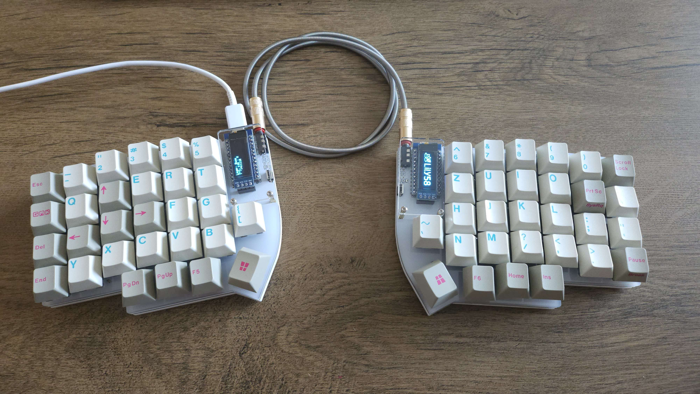

# Configuration for the Lily58 Pro keyboard

All configuration stored in `keymap.c`

This is a partial fork of the [QMK repo](https://github.com/qmk/qmk_firmware) (Only the Lily58 part) together with the [bongo cat repository](https://github.com/Rwarcards762/lily58_bongocat).

